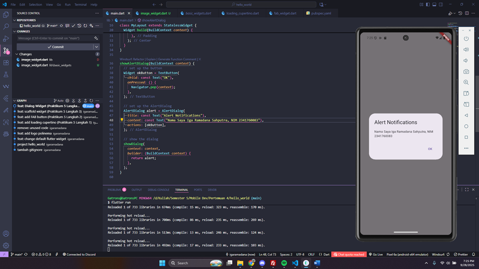

# 📱 Praktikum Flutter — Hello World & Widget Dasar

**Mata Kuliah:** Pemrograman Mobile
**Nama:** Iga Ramadana Sahputra  
**NIM:** 2341760083  
**Kelas:** SIB 3C  
**No Absen:** 15

**Repository:** [flutter-fundamental-part1](https://github.com/aqwenaaa/flutter-fundamental-part1.git)

---

## 📌 Praktikum 1: Membuat Project Flutter Baru

- Membuat project `hello_world` dengan **VS Code**.
- Struktur project berhasil dibuat dengan pesan: `Your Flutter Project is ready!`.
- Output awal adalah aplikasi counter bawaan Flutter.

📷 **Screenshot:**  

---

## 📌 Praktikum 2: Menjalankan Aplikasi di Emulator & Perangkat Fisik

- Aplikasi dijalankan pada **emulator Android**.
- Nama & NIM ditampilkan pada tampilan aplikasi untuk identitas.

📷 **Screenshot Emulator:**  

---

## 📌 Praktikum 3: Integrasi GitHub & Dokumentasi

- Membuat repository GitHub: `flutter-fundamental-part1`.
- Melakukan **init, add remote, commit, push** dari VS Code.
- Semua file (source + README + screenshot) sudah terdokumentasi.

📷 **Screenshot Repo GitHub:**  

---

## 📌 Praktikum 4: Widget Dasar

### 🔹 Langkah 1 — Text Widget

Menampilkan teks dengan gaya warna merah dan ukuran font 14.

📷 **Screenshot:**  

### 🔹 Langkah 2 — Image Widget

Menampilkan gambar dari `assets/logo_polinema.jpg`.

📷 **Screenshot:**  

---

## 📌 Praktikum 5: Widget Material Design & Cupertino

### 🔹 Langkah 1 — Cupertino Button & Loading

📷 **Screenshot:**  

### 🔹 Langkah 2 — Floating Action Button (FAB)

📷 **Screenshot:**  

### 🔹 Langkah 3 — Scaffold Widget

📷 **Screenshot:**  

### 🔹 Langkah 4 — Dialog Widget

📷 **Screenshot:**  

### 🔹 Langkah 5 — Input & Selection (TextField)

📷 **Screenshot:**  

### 🔹 Langkah 6 — Date Picker

📷 **Screenshot:**  

---
